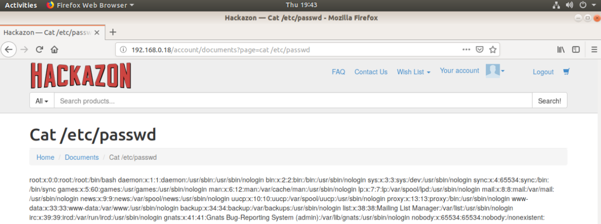

# Web Vulnerabilities Homework Week 2 

Over the past two weeks, you've studied the most important vulnerabilities in OWASP:
- Cross-Site Scripting (XSS)
- SQL Injection
- Command Injection
- Local and Remote File Inclusion
- File Upload Vulnerabilities

This weeks homework will be a review for web vulnerabilities week two. Specifically the homework will be segmented into three parts:
- Part 1: Local File Inclusion 
- Part 2: Command Injection
- Part 3: Cross Site Scripting (XSS)

**Scenario:**

The scenario of the day is **a penetration test for an online retailer**. You will be completing three exercises, in order to accomplish this. 

**Lab Environment**

- [Run Me](run_me)
- [Script](script)

You will only need to run the **run_me** script, as it will run the dependencies script for you. The run_me script is the only script that needs to be ran. 

To run the script you will need to do the following
- Download the script onto your VM.
- Change the permissions by running `chmod +x run_me && chmod +x dependencies`
- Run the script `./script`. 

If you are using VMware, run the following commands:
- `sudo rm -rf /var/lib/apt/lists/*`
- `sudo apt-get clean`
- `sudo apt-get update`
- `chmod +x run_me && chmod +x dependencies`
- `./script`. 

- After running this script, you will be able to access Hackazon and DVWA through your web browser by navigating to `http://hackazon.com` and `http://dvwa.com`.

**Note**: Every time you reboot your machine, you'll need to start DVWA and Hackazon by running the following commands:

- `/usr/local/bin/start_dvwa`
- `/usr/local/bin/start_hackazon`

---

## Part 1: Local File Inclusion (0:15)

## Local File Inclusion 

**Scenario**

Recently your company was hired to pentest a online retailer called Hackazon.com. The Hackazon IT department have received tips that employees have been able to access their colleagues data through URL manipulation. Hackazon has asked that you and you team verify these claims before the make any updates to their website. Your job is to use LFI to see if you can access any confidential information on the server. 

**Instructions**

- Before you begin, click in the upper right hand corner and create a username and password.
- Click on `My Documents` then click on any documents from the list. 
- Using **only** the LFI techniques that you have learned this past week, see if you can read the following confidential information from the server:
  - The `/etc/hosts` file
  - The `/etc/passwd` file

## Review Exercise 1: Local File Inclusion (0:05)

Use the following solution to guide your review:

**Instructions**

Remind students that in the previous exercise we were checking to see if we could manipulate the URL to receive data back from the server. Specifically, we had to manipulate the URL of the documents page, and exploit it to prove that this is an issue.

Explain that this requires the following steps
- Identify the potential injection point
- Test the injection point for code sanitization errors
- Use our own code to exploit the vulnerability

Point out to students that because this is an injection attack, these steps are similar to exploiting LFI vulnerabilities. 

Let students know that you'll proceed by explaining how to accomplish each of these steps.

#### Identify the injection point

Explain to students to identify the injection point:

- We need to find a page on the site that will allow us to enter in our own parameters. 
- In the instructions we were told to login and go to `My Documents`. If we click on one of the documents we can see that the URL is showing `page=`. 

Highlight the area for the students

Explain that this means that the URL is using the `page=` parameter to locate the document, and bring it from the server to our web page. This is showing us the bridge from the server to us. This would make a great injection point, because it is asking us what we would like _retrieved_ from the server. 

#### Test the injection point for code sanitization errors

Explain to students that: 
- We then can now try to navigate through the server as we would would navigate through a Linux instance. 
- To do this we would use the command `../`. Recall that `../`  will take us back one directory.

Replace `page=delivery.html` with `../`

Point out to students that this website is not using data sanitization. We know this because we can see our code displayed on the webpage. This means that this is a good injection point. 

#### Use our own code to exploit the vulnerability. 

Explain to students that:

- Recall that webpages are just files located in directories in a server. We need to navigate out of the directory that we currently are in, and go back several directories until we get to where we want to go. 
- From here, it's mostly trial and error to find the file that we are looking for. We _do not_ know how many directories back where we will have to go. 
- However, because we know that this is a Linux OS and the file we are looking for, we should be able to find it if we continue to use the code `../etc/passwd`. 

Demo this by typing `../etc/passwd` until you reach the file. 

In our case the directory structure was built nine directories down from the `/etc/passwd` file. 

### Summary

In order to exploit the LFI vulnerabilities in the future, recall the steps that we have taken:

- We identified the injection point
- We tested the injection point for code sanitization errors
- We used our own code to exploit the vulnerability

## Exercise 2: Command Injection (0:10)

## Command Injection 

**Scenario**

Because the server is vulnerable to navigation via shell code, we might be able to send commands to the server and have it process them. If this is true, it will put the employees confidential information at risk. Because of this risk, Hackazon has asked you to test for command injection vulnerabilities. 

**Instructions**

- Before you begin, click in the upper right hand corner and login using the username `admin` and the password you set up for the MySQL database.
- Click on `My Documents` then any attached document.
- Using **only** the command injection techniques that you have learned this past week, see if you can read the following information from the server: 
  - The `/etc/hosts` file
  - The `/etc/passwd` file

In addition to finding those files on the server, see if you can find information about the server itself. Specifically:

- All the groups on the server
- The Kernel
- Any cronjobs they may have
  
## Review Exercise 2: Command Injection (0:05)

Use the following solution to guide your review:

Remind students that in the first exercise they were able to navigate through the directory structure of the web server, because there wasn't any preconfigured input sanitation. In this last exercise their goal was to take advantage of the lack of input sanitization again and reach the confidential documents on the server. Specifically, they had to _find_ a command injection vulnerability, then _exploit_ it to prove that it's a problem.

Explain that this requires the following steps:
  - Identify command injection points
  - Test the command injection points for code sanitization errors
  - Use command injection on the vulnerable page

Emphasize that these steps are similar to LFI because they are injection vulnerabilities. 

Because we know that the target uses shell code, we'll try to inject shell code to exploit the machine. Specifically our goal is to read the private documents such as `/etc/passwd`. 

Let students know that you'll proceed by explaining how to accomplish each of these steps.

#### Identify command injection points

Explain to the students that to identify the injection point:

- Like the first exercise, we need to find a location where the website will take our code input, and will act on it. However this time we will be trying to use code to read documents, not navigate through the server.
- In the last exercise we found two successful attack vectors. The URL bar and the search bar. Let's try to use those again.

#### Test the command injection points for code sanitization errors

Explain that i'm going to use the search bar first. 
  - Type: `cat /etc/hosts` into the search bar. 
  

Ask the class why they think this attack failed. Give students time to answer and reposed to each idea presented. 

Point out that this injection failed, for any of the following reasons:

- Just because one area of the website is vulnerable to an attack doesn't mean that it is vulnerable to every attack. 
- This could be because they have _some_ data sanitization for that attack applied here but not elsewhere. 
- There could also be code on the backend on how it processes commands that would not be able to process the commands we are putting in. 

In the URL bar type `cat /etc/hosts`. 

Explain that it looks like this is an attack vector that is susceptible to command injection. 

#### Use shell code on the vulnerable page

Now that we have identified that this page _is_ vulnerable to command injection. We can try to read the `/etc/passwd` document. 
-  Type: `cat /etc/passwd`

Point out we can now see the `/etc/passwd` document. Using this same format use the answers below to show students how to get the group, kernal and crontab listings. 

For the groups:
-  Type: `cat /etc/group`

For the kernal:
-  Type: `cat /etc/issue`

For the crontab:
-  Type: `cat /etc/crontab`

Ask for any questions before proceeding.

#### Summary

Explain to students to exploit command injection in the future recall the steps that we have taken:
- We identified the command injection points
- We tested the command injection points for code sanitization errors
- We used shell code on the vulnerable page

## Exercise 3: Manually preforming XSS (0:10)

## Manually preforming XSS

Vulnerability to command injection would suggest other injection vulnerabilities such as cross-site-scripting (XSS). Because we verified that command injection attacks is an issue, the next step would be to see if we could inject our own code to access other confidential information located onto the Hackazon server. 

**Instructions**

- Find an injection point
- Inject the characters
- Send the payload

Emphasize again that these steps are similar to LFI, and Command injection because they are injection vulnerabilities. 

**Challenge**

Cause an alert to pop up with the users cookie using XSS

## Review Exercise 3: Manually preforming XSS (0:05)

Use the following solution to guide your review:

Remind students that in the previous exercise they checked the Hackazon website for XSS injection vulnerabilities. Specifically, they had to _find_ an XSS vulnerability, and then _exploit_ it to prove that it is a problem. 

Explain that this requires the following steps:
  - Identify potential injection points
  - Test injection points for sanitization errors
  - Inject the XSS payload on vulnerable pages

#### Identifying Injection Points

Explain to the students that to identify the injection point:
- We need to find a location where the website takes in our input, and either saves it to the database or prints it to the page. This perfectly describes the search bar. 
- For example, think about the process for when we search for an item, such as an NBA card on the website. We are typing keywords (NBA card), that the website will take as input, then act on the server to **display** for us. 
- Because the server is taking the information that we type in, and using it to send commands to the server, we can put our own code in, and have the server act upon it.
- Servers with poor input sanitization will print out whatever you send, including code. 
- That means if we send the server code that the browser can run, the browser will run it. In this case, the server with poor input sanitization is our Hackazon server. 

Click on "Search" without any input. 

The search bar and the URL bar have worked for previous exercises so we can use those

Point out that the URL that says `String=` is another fantastic injection point. Point out we can enter whatever we want on the `=` sign and the server will execute or printed back out to the page.

#### Testing Injection Points

Explain to students that now that we've identified our injection points, we can now try to inject our own code into the website. 

Using either of the two injection sites type: `` 

Point out that the box that now appeared shows that these injection points are vulnerable.

#### Injecting Payloads

Explain to students that the challenge can be completed by implementing the same technique.

At the same injection point that you used for the alert type" ``

Explain the we've now captured the cookies in basic javascript.

#### Summary

Explain to students in order to find XSS vulnerabilities in the future, recall the steps we have taken:

- We identified the injection points
- We tested the injection point for code sanitization errors
- We used our own code to exploit the vulnerability

## Summary and Questions (0:15)
 
Summarize that today we covered topics from the past week, specifically:

- Local File Inclusion 
- Command Injection
- SQL Injections

Verify if there are any questions about the homework, or activities before dismissing the class. 
